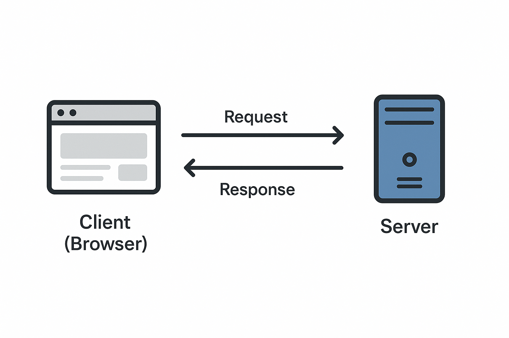

Web application pentesting (penetration testing) is the process of testing a website or web application for security vulnerabilities that can be exploited by attackers. It mimics real-world attacks to identify potential weaknesses before a malicious actor can.

## Understanding Web Application

- A **client** (user's browser) sends a **request** to a **server**.
- The **server** processes it and sends a **response**.
- The **web browser** displays the result to the user.

> "Through the web application, we access the services hosted on a server by the company."

(attachment:e83e8f00-b2ef-4a8d-a138-928ecc899432:image.png)

## Server and Services

- A single server can host **multiple services**.
- Each service runs on a **different port** (e.g., HTTP on port 80, HTTPS on port 443).

## Client-Server Architecture

Client-Server architecture is a model where the **client requests resources**, and the **server provides them**.

### Example:

🛒 **Amazon** / **Flipkart** are e-commerce platforms:

- Client: You (using the browser)
- Server: Amazon's backend server that processes orders, payments, etc.

### Tool Used:

🛠️ **Burp Suite**: A powerful tool to intercept, analyze, and manipulate HTTP/HTTPS traffic between the browser and the server.

## Real-World Story

> In the news, many students were found booking flight tickets for ₹1 or free. How?

🔍 Reason: They exploited a **vulnerability in the website’s logic** or **payment gateway**.

## Protocols

### HTTP vs HTTPS

| Feature    | HTTP                        | HTTPS                              |
| ---------- | --------------------------- | ---------------------------------- |
| Full Form  | HyperText Transfer Protocol | HyperText Transfer Protocol Secure |
| Port       | 80                          | 443                                |
| Encryption | ❌ No                       | ✅ Yes (TLS/SSL)                   |
| Secure?    | ❌ No                       | ✅ Yes                             |

> Always prefer HTTPS as it protects data during transmission.

### HTTP Methods (Verbs)

Used to **interact with resources** on the server.

| Method | Purpose               | Description                                  |
| ------ | --------------------- | -------------------------------------------- |
| GET    | Read data             | Fetch data from the server (e.g., load page) |
| POST   | Create new data       | Send new data to server (e.g., submit form)  |
| PUT    | Update existing data  | Update the full resource                     |
| PATCH  | Update partial data   | Update specific fields only                  |
| DELETE | Delete data           | Remove a resource                            |
| HEAD   | Header only (no body) | Same as GET but only returns headers         |
| TRACE  | Debugging             | Echoes back the received request             |

### POST vs PUT vs PATCH – Key Differences

| Feature    | POST                   | PUT                                                     |
| ---------- | ---------------------- | ------------------------------------------------------- |
| Action     | Creates a new resource | Updates an existing resource (or creates if not exists) |
| Idempotent | ❌ No                  | ✅ Yes (repeating doesn't change outcome)               |
| Usage      | Form submission        | Updating a profile, etc.                                |

| Feature            | **PUT**                                                  | **PATCH**                                                  |
| ------------------ | -------------------------------------------------------- | ---------------------------------------------------------- |
| **Purpose**        | Replace **entire** resource                              | Modify **part** of a resource                              |
| **Idempotent**     | ✅ Yes (multiple same requests = same result)            | ✅ Yes (usually, but depends on implementation)            |
| **Request Body**   | Contains **full** data of the resource                   | Contains **only the fields** to update                     |
| **Usage Scenario** | Overwriting all fields (e.g., updating entire user info) | Updating single/multiple fields (e.g., just email or name) |
| **Performance**    | Can be heavier (more data sent)                          | Lighter (less data sent)                                   |
| **Example**        | Replacing full profile (name, email, phone)              | Updating just the email field                              |
